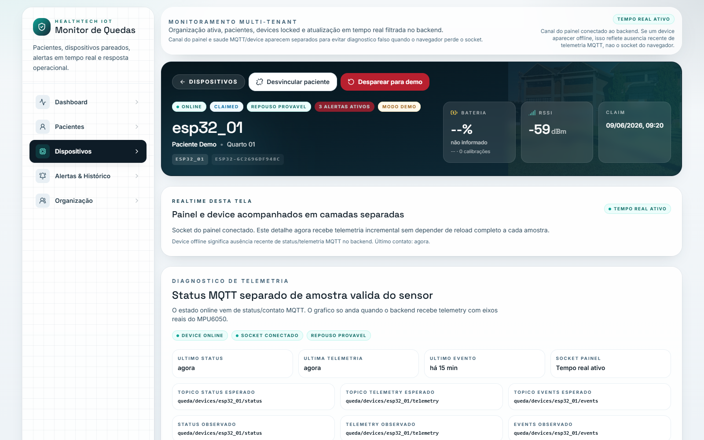
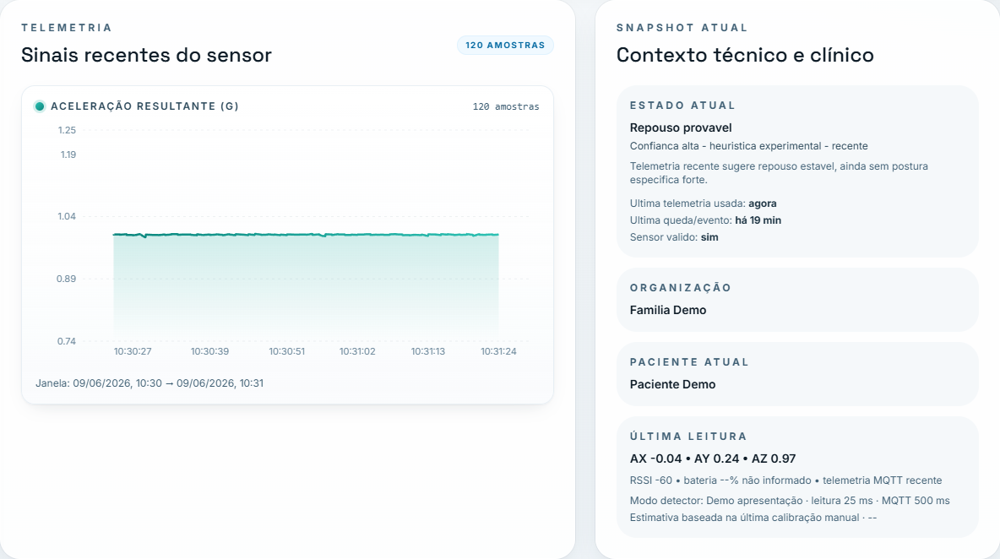
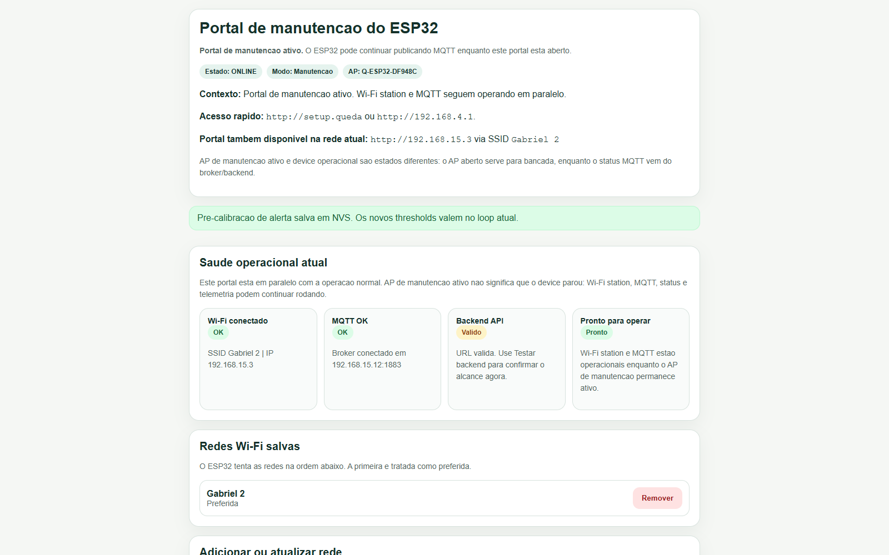
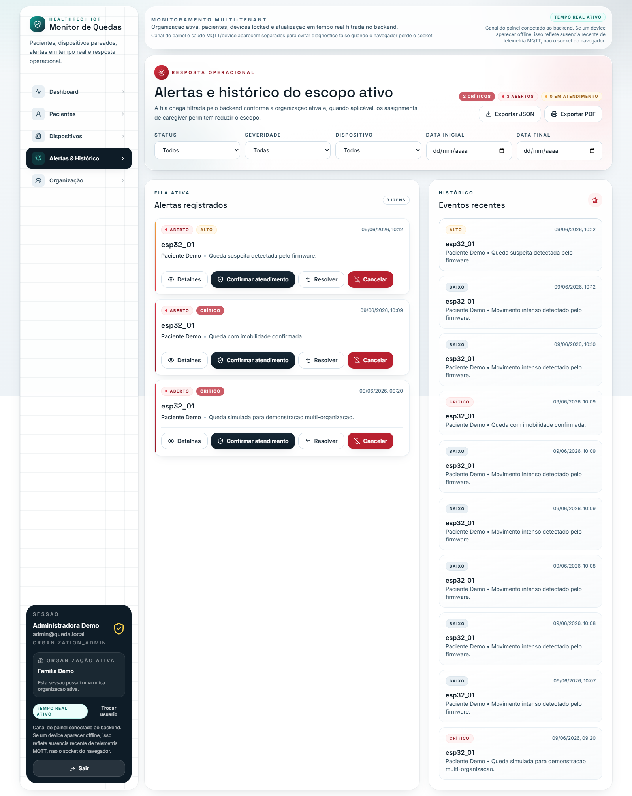

# Sistema IoT de Detecção de Quedas com ESP32

Projeto acadêmico full-stack para monitoramento de quedas, imobilidade e telemetria com firmware `ESP32 + MPU6050`, comunicação `MQTT`, backend `Node.js + Express + MySQL + Socket.IO` e frontend `React + Vite + TypeScript + Tailwind CSS`.

O objetivo do repositório é integrar hardware embarcado, ingestão de eventos, persistência, atualização em tempo real e uma interface web multi-tenant para acompanhamento operacional de pacientes, dispositivos e alertas.

## Baseline Atual

Baseline atual do repositório: `v0.9.0`.

A `v0.9.0` integra uma demo acadêmica controlada sem substituir o comportamento conservador: o portal alterna entre modos Normal e Demo, a FSM continua exigindo impacto, mudança de orientação e imobilidade, e o buzzer permanece reservado para queda confirmada e SOS. A versão também adiciona identidade própria ao frontend e uma estimativa experimental de bateria por tempo, recalibrada manualmente e aprendida gradualmente.

O sistema é um projeto IoT full-stack com ESP32, MPU6050, MQTT, Node.js, MySQL, Socket.IO, React, JWT, histórico, exportação PDF/JSON, modo demo e estimativa de bateria por calibração manual. O histórico completo de versões fica em [CHANGELOG.md](CHANGELOG.md).

## Visão Geral

O projeto é composto por:

- firmware para `ESP32`, com leitura do sensor `MPU6050`
- comunicação MQTT entre dispositivo e backend
- backend `Node.js` com `Express`, API REST, bridge MQTT e emissão `Socket.IO`
- banco de dados `MySQL`
- frontend web em `React`, `Vite`, `TypeScript` e `Tailwind CSS`
- portal local de configuração do ESP32
- dashboard multi-tenant por organização

O modelo atual deixou de ser um painel global único e passou a trabalhar com organizações, membros, pacientes, dispositivos, vínculos e histórico de assignments. O backend preserva o contrato MQTT existente, mas passa a persistir o escopo de `organization_id`, `patient_id` e `device_assignment_history_id` no momento da ingestão para manter rastreabilidade.

## Principais Funcionalidades

- pareamento seguro por código temporário
- cadastro, descoberta técnica e reivindicação (`claim`) de dispositivos
- vínculo de dispositivo com paciente
- histórico de vínculos entre dispositivo e paciente
- dashboard multi-tenant por organização
- controle de acesso por papel e organização ativa
- ingestão MQTT de eventos, status e telemetria
- reconciliação segura entre `device_uid` real do ESP32 e cadastros legados `legacy:{device_id}` já pareados
- lock leve por device na ingestão MQTT para reduzir corrida entre status/eventos/telemetria simultâneos
- alertas idempotentes por evento MQTT persistido
- confiabilidade de eventos críticos MQTT com `event_uuid`, `sample_seq`, fila local e deduplicação no backend
- pré-calibração experimental de alertas pelo portal do ESP32, com thresholds persistidos em `NVS`
- eventos `fall_suspected` e `movement_detected` para teste ponta a ponta de alerta real em bancada
- identificação explícita de `MPU6050`, `MPU6500` e `MPU9250` por `WHO_AM_I`
- descarte de pacote raw totalmente zerado para não publicar amostra falsa
- recovery I2C também por volume de falhas intermitentes, além de falhas consecutivas
- vínculo técnico entre queda detectada e janela de telemetria relacionada
- evidência estruturada do firmware para `fall_detected`, com versão do algoritmo, janela, picos, imobilidade e features no domínio do tempo
- base experimental para FFT/Fourier e calibração futura por classes de movimento, sem trocar a decisão principal atual
- logs de ingestão MQTT com `correlationId`, escopo, duração e motivo de descarte
- testes unitários e de integração leve para alertas, ingestão MQTT e realtime escopado
- suite de stress dry-run para rajadas de telemetria, quedas, payloads ruins e concorrência
- alertas de queda e imobilidade
- exportação do histórico de alertas filtrado em JSON e visualização imprimível para salvar em PDF
- telemetria em tempo real no dashboard
- gráfico de telemetria com eixo Y normalizado, unidades e tooltip técnico para aceleração, giroscópio e eixos do sensor
- atualização do navegador via `Socket.IO`
- portal local do ESP32 para Wi-Fi, MQTT, backend e pareamento
- opção de AP/portal de manutenção sempre ativo em bancada, sem bloquear telemetria MQTT
- bloco de saúde operacional no portal do ESP32 com testes de backend e MQTT
- diagnóstico de realtime/socket no frontend
- separação entre saúde do socket do navegador e saúde operacional do dispositivo
- status comportamental/postural heurístico experimental
- estados explícitos para sensor inválido, telemetria desatualizada, movimento leve/intenso, queda, SOS manual e calibração pendente
- suporte a buzzer, logs de diagnóstico e botão `Testar buzzer` no portal ESP32
- bateria manual opcional no portal ESP32, com origem explícita no MQTT e exibição `--%` quando não há valor configurado
- bateria estimada por tempo com taxa inicial de `33.5 min/%`, histórico e aprendizado suavizado por calibrações manuais
- modos Normal e Demo apresentação, sem transformar movimento isolado em queda confirmada
- scripts Windows para setup, banco, start, stop e smoke test

## Modo Demo

O portal ESP32 oferece `Modo de operação`:

- **Normal:** leitura interna a `50 ms`, telemetria MQTT a `2000 ms`, impacto `2.2 g`, giro `120 dps`, orientação `45°` e imobilidade `2000 ms`.
- **Demo apresentação:** leitura interna a `25 ms`, telemetria MQTT a `500 ms`, impacto `1.7 g`, giro `100 dps`, orientação `30°` e imobilidade `1000 ms`.

A build acadêmica inicia em **Demo apresentação** quando o dispositivo ainda não possui configuração salva. Para operação conservadora, selecione **Normal** no portal. Uma escolha já persistida em NVS continua sendo respeitada, portanto um device configurado anteriormente como Normal não é forçado para Demo.

A leitura interna rápida alimenta o detector; a publicação MQTT moderada mantém gráfico e backend fluidos sem atualizar o site a cada amostra. Eventos críticos continuam imediatos. Para demonstrar, use somente a caixinha/sensor em cama, almofada ou superfície macia: aplique movimento controlado, vire/deite e deixe imóvel. Nunca teste queda com pessoa nem jogue o sensor com força.

## Estimativa de Bateria

O campo `Bateria atual (%)` do portal cria uma calibração manual. O backend estima o percentual pelo tempo decorrido, iniciando em `33.5 min/%` (aproximadamente `56 h` no cenário observado), e aprende gradualmente com novas calibrações válidas usando suavização `70/30`.

Essa informação não é medição elétrica real. Calibrações com aumento de percentual, tempo curto ou taxa fora de `5..120 min/%` não alteram a taxa aprendida. Para aplicar a estrutura incremental em banco existente, sem reset:

```powershell
npm run db:migrate:battery-estimation --prefix backend
```

## Capturas de Tela

As imagens abaixo são capturas reais da `v0.9.0`, registradas em 9 de junho de 2026 com ESP32, MQTT, backend e frontend operando. Nenhum mockup ou screenshot antigo foi apresentado como captura atual.

### Device online e modo Demo



Device real online, organização ativa, Modo Demo, telemetria recente e tópicos MQTT observados.

### Telemetria com 120 amostras



Gráfico real com `120` amostras e snapshot exibindo leitura a `25 ms` e publicação MQTT a `500 ms`.

### Portal ESP32 operacional



Portal real com estado `ONLINE`, AP de manutenção ativo, Wi-Fi station, MQTT e backend operando em paralelo.

### Queda confirmada



Tela real de alertas contendo a queda com imobilidade confirmada recebida do firmware.

O inventário completo, as capturas adicionais do portal e os assets ainda pendentes ficam em [docs/assets/README.md](docs/assets/README.md).

## Arquitetura

```text
ESP32 + MPU6050
      |
      | MQTT
      v
Broker MQTT
      |
      v
Backend Node.js + Express + Socket.IO
      |
      v
MySQL
      |
      v
Frontend React + Vite
```

### Camadas

- **Firmware ESP32:** lê o `MPU6050`, executa a detecção local, publica `events`, `status` e `telemetry`, mantém configurações em `NVS` e oferece portal local de configuração.
- **Broker MQTT:** transporta mensagens do ESP32 para o backend nos tópicos `queda/devices/{deviceId}/events`, `status` e `telemetry`.
- **Backend API REST:** autentica usuários, aplica escopo multi-tenant, gerencia pacientes, dispositivos, pareamento, alertas e ingestão.
- **Banco MySQL:** armazena organizações, membros, pacientes, dispositivos, histórico de vínculos, eventos, alertas, status e telemetria.
- **Socket.IO:** entrega atualizações do backend para o navegador em tempo real.
- **Frontend Web:** oferece dashboard operacional, telas de pacientes, dispositivos, alertas, organização, pareamento e detalhe de dispositivo.

## Estrutura de Pastas

```text
/
  backend/     API REST, bridge MQTT, Socket.IO, scripts de backend e .env.example
  frontend/    aplicação React/Vite, telas web, serviços, tipos e .env.example
  src/         firmware do ESP32 em C++/Arduino
  include/     headers, constantes, modelos e configuração do firmware
  database/    schema.sql e seed.sql do MySQL
  docs/        documentação complementar de integração, firmware, quickstart e regras
  scripts/     automações PowerShell e auxiliares de desenvolvimento
  test/        estrutura reservada para testes do PlatformIO
```

Arquivos principais na raiz:

- [CHANGELOG.md](CHANGELOG.md)
- [docs/alerting-architecture.md](docs/alerting-architecture.md)
- [LICENSE](LICENSE)
- [package.json](package.json)
- [platformio.ini](platformio.ini)

## Requisitos

- `Node.js 20+`
- `npm`
- `MySQL Server` ou acesso a um servidor MySQL compatível
- `PlatformIO` para compilar e gravar o firmware
- placa `ESP32`
- sensor `MPU6050`
- broker MQTT local ou remoto
- navegador moderno
- PowerShell no Windows para usar os scripts da raiz

## Configuração Rápida

Para o passo a passo completo no Windows, consulte [docs/quickstart-windows.md](docs/quickstart-windows.md).

Fluxo de alto nível:

1. Clone o repositório.
2. Instale as dependências com os scripts do projeto ou manualmente em `backend/` e `frontend/`.
3. Configure os arquivos `.env` a partir dos exemplos existentes.
4. Inicialize o banco MySQL com `database/schema.sql` e `database/seed.sql`.
5. Suba backend, frontend e, se necessário, broker MQTT local.
6. Configure o firmware em [include/app_config.h](include/app_config.h) quando precisar ajustar defaults de fábrica.
7. Grave o firmware no ESP32 com PlatformIO.
8. Use o portal local do ESP32 para configurar Wi-Fi, MQTT, URL do backend e código de pareamento.
9. Gere um código temporário de pareamento no dashboard.
10. Pareie o dispositivo pelo portal local do ESP32.

### Scripts Disponíveis na Raiz

```powershell
.\scripts\check-env.ps1
.\scripts\setup-dev.ps1
.\scripts\init-db.ps1
.\scripts\start-all.ps1 -StartMock
.\scripts\smoke-test.ps1
.\scripts\stop-all.ps1
```

Atalhos equivalentes no [package.json](package.json):

```powershell
npm run dev:check
npm run dev:setup
npm run dev:init-db
npm run dev:start
npm run dev:smoke
npm run dev:stop
```

Testes técnicos do backend:

```powershell
npm run check --prefix backend
npm test --prefix backend
npm run test:smoke --prefix backend
npm run test:integration --prefix backend
npm run test:alerts --prefix backend
npm run test:mqtt --prefix backend
npm run stress:dry --prefix backend
npm run stress:real --prefix backend
npm run db:migrate:alert-actions --prefix backend
npm run db:migrate:evidence --prefix backend
npm run db:migrate:sensor-diagnostics --prefix backend
npm run mqtt:watch --prefix backend
npm run mqtt:publish:test --prefix backend
```

`stress:dry` usa mocks locais para regressão rápida. `stress:real` valida backend `/health`, broker MQTT e MySQL de desenvolvimento antes de publicar MQTT real. Os logs ficam em `backend/logs/stress/` (`*.jsonl`, `summary-*.json`, `failures-*.json`, `report-*.md`) e são ignorados pelo Git.

Para preparar uma banca ou entrega acadêmica, use o [roteiro de demonstração](docs/roteiro-demonstracao.md) e o [checklist de validação](docs/checklist-validacao.md). Os documentos distinguem testes com mocks, smoke com serviços locais reais e validações manuais com ESP32.

`db:migrate:alert-actions` garante a tabela de ações humanas em bancos existentes sem resetar dados. `db:migrate:evidence` aplica apenas a migração idempotente das colunas/tabela de evidência. `db:migrate:sensor-diagnostics` adiciona os campos de saúde do sensor em `device_status` sem reset destrutivo. `mqtt:watch` assina os tópicos reais `queda/devices/+/status`, `telemetry` e `events` para confirmar se o ESP32 está publicando.

Para validar telemetria real do ESP32, deixe `mqtt:watch` aberto, reinicie a placa e acompanhe o Serial Monitor. O funcionamento esperado mostra `[mqtt] connected`, `[sensor] read ok`, `[telemetry] publish ok` repetindo no intervalo configurado e linhas novas em `queda/devices/esp32_01/telemetry`. Telemetria simulada vem do `clientId` de teste e serve para validar backend/frontend; telemetria real deve vir do `clientId` configurado no ESP32, como `esp32_01_client`.

No frontend, o gráfico principal de `Sinais recentes do sensor` mostra `Aceleração resultante (g)`. Valores inválidos, `NaN`, infinitos ou fora de escala operacional visual são filtrados apenas no gráfico; MQTT, backend, banco e payloads continuam preservados.

Para validar a escala física da IMU, deixe o ESP32 parado sobre a mesa ao reiniciar. O Serial Monitor deve mostrar o modelo (`MPU6050`, `MPU6500` ou `MPU9250`), a faixa efetiva (`accel=+-2g`, `+-4g`, `+-8g` ou `+-16g`), o divisor `lsb_per_g` usado e leituras convertidas com `raw_magnitude_g`, `corrected_magnitude_g` e `filtered_magnitude_g` perto de `1.00 g` em repouso. Se aparecer algo perto de `4 g`, há erro de escala ou movimento durante a calibração.

Se a calibração ou o readback de escala falhar, o firmware deve continuar operando com fallback: procure `ready=1`, `calibrated=0` e `continuing_without_offsets` no Serial Monitor. Se não houver amostra válida, o `status` continua saindo com diagnóstico e a telemetria é pulada com motivo claro, como `sensor_not_ready`, `no_valid_sample` ou `stale_sample`.

Se aparecer erro repetido do Wire como `i2cWriteReadNonStop returned Error -1`, valide primeiro o hardware do barramento: GND comum, VCC correto no módulo, SDA/SCL nos pinos configurados, fios curtos, contato da protoboard e alimentação estável. A build atual usa `I2C_CLOCK_HZ = 100000`, `I2C_USE_REPEATED_START = false`, retry curto, descarte de raw all-zero e recovery do barramento para reduzir falhas transitórias sem travar Wi-Fi/MQTT.

O fluxo local esperado usa:

- backend em `http://localhost:4000`
- frontend em `http://localhost:5173`
- broker de desenvolvimento na porta `1883`, com bind padrão em `0.0.0.0` quando iniciado localmente

Após aplicar o seed, o ambiente demo cria:

- organização `Familia Demo`
- usuário `admin@queda.local`
- senha `Admin@123`
- paciente `Paciente Demo`
- dispositivo demo `legacy:esp32_01`

Importante: a versão atual de [database/schema.sql](database/schema.sql) recria o schema do projeto. O script `init-db` deve ser tratado como reset do ambiente local para o modelo multi-tenant atual.

## Variáveis de Ambiente

O repositório possui exemplos versionados:

- [backend/.env.example](backend/.env.example)
- [frontend/.env.example](frontend/.env.example)

Não inclua arquivos `.env`, credenciais reais, tokens, chaves, dumps ou logs no repositório.

No backend, as variáveis principais cobrem:

- porta HTTP
- segredo JWT local
- conexão MySQL
- URL e credenciais MQTT
- base de tópicos MQTT
- opções de reconnect, keepalive e TLS
- limiar de dispositivo offline

No frontend, as variáveis principais são:

- `VITE_API_URL`
- `VITE_SOCKET_URL`

Para o ESP32 físico, não use `localhost`, `127.0.0.1` ou `::1` como backend ou broker. Use o IP real do notebook na rede atual, um host acessível na mesma rede ou um serviço externo.

No Windows, `localhost:1883` funcionando no notebook não garante que o ESP32 consiga abrir TCP no broker. Para o broker local de desenvolvimento, `backend/scripts/devBroker.js` usa por padrão:

```env
MQTT_BIND_HOST=0.0.0.0
MQTT_PORT=1883
```

Valide o acesso que o ESP32 precisa usando o IPv4 real do notebook:

```powershell
Test-NetConnection IP_DO_NOTEBOOK -Port 1883
```

O esperado é `TcpTestSucceeded : True`. Em redes institucionais, firewall ou isolamento entre clientes ainda podem bloquear o acesso mesmo com o bind correto.

Esse teste valida apenas TCP. Para validar MQTT de verdade, use um cliente MQTT e confirme o recebimento de `CONNACK`:

```powershell
cd backend
npm run mqtt:test -- 127.0.0.1 1883
npm run mqtt:test -- IP_DO_NOTEBOOK 1883
```

O esperado é `MQTT handshake OK`. Para o backend rodando no mesmo notebook, prefira `MQTT_BROKER_URL=mqtt://127.0.0.1:1883`; para o ESP32, use o IPv4 real do notebook.

## Fluxo de Pareamento

O pareamento definitivo do dispositivo não acontece por MQTT. Ele acontece por HTTP entre o portal local do ESP32 e o backend.

1. Um usuário com permissão gera um código temporário no dashboard.
2. O dashboard consulta `GET /api/system/network-info` para sugerir uma URL de backend acessível na rede atual.
3. O ESP32 abre o portal local `Q-ESP32-*` quando entra em modo de configuração ou mantém esse AP de manutenção ativo em bancada com `SETUP_PORTAL_ALWAYS_ON = true`.
4. O usuário informa `BACKEND_API_BASE_URL` e o código temporário no portal.
5. O ESP32 envia `device_uid`, `device_id`, `device_name` e `pairing_code` para `POST /api/pairing/claim`.
6. O backend valida código, expiração, uso único e organização.
7. O dispositivo passa para `claimed` e fica associado à organização.
8. Se o código tiver paciente inicial, o backend cria o vínculo inicial.
9. O backend devolve `deviceSyncToken` e um resumo do perfil do paciente atual.
10. O backend emite atualização em tempo real.
11. O dashboard atualiza o estado do dispositivo.

Devices desconhecidos que chegam via MQTT podem ser criados tecnicamente como `unclaimed`, mas só passam a pertencer a uma organização após o claim.

## MQTT e Tempo Real

MQTT e `Socket.IO` têm papéis diferentes no projeto:

- **MQTT:** comunicação do ESP32 para o backend, com eventos, status e telemetria.
- **Socket.IO:** comunicação do backend para o navegador, com atualizações em tempo real.
- **Device online/offline:** estado operacional derivado de presença recente de status ou telemetria MQTT no backend.

Eventos `Socket.IO` atuais:

- `alert:new`
- `alert:updated`
- `device:status`
- `telemetry:new`

O diagnóstico de realtime no frontend separa o socket do navegador da saúde MQTT/device. Portanto, uma mensagem de socket indisponível no navegador não significa necessariamente que o ESP32, o broker MQTT ou a ingestão MQTT tenham caído.

No firmware, os tópicos continuam seguindo `queda/devices/{deviceId}/status`, `queda/devices/{deviceId}/telemetry` e `queda/devices/{deviceId}/events`. Para status online/offline, o backend usa a hora em que recebeu MQTT como `lastSeenAt`. Para telemetria/eventos, timestamps do device só são usados quando estão plausíveis e próximos do recebimento; se o NTP estiver ausente ou stale, a hora do backend entra como fallback para evitar gráfico antigo e falso offline.

Após F5 em rota protegida, o frontend preserva o token, reidrata o usuário via `GET /api/me`, descarta apenas uma organização salva inválida e só cria o Socket.IO depois que a sessão mínima está hidratada.

## Relatórios de Alertas

A tela **Alertas e Histórico** permite aplicar os filtros existentes de status, severidade, dispositivo, data inicial e data final e exportar o mesmo escopo em:

- **JSON:** baixa o relatório estruturado retornado por `GET /api/alerts/export`
- **PDF imprimível:** abre uma visualização própria para impressão e usa `window.print()`, permitindo salvar em PDF pelo navegador

A rota de exportação continua protegida por JWT, recebe a organização ativa via `X-Organization-Id`, reutiliza o escopo multi-tenant da listagem de alertas e limita cada relatório a `500` registros. Ações de acknowledge, cancelamento e resolução continuam gerando `alert_actions` e `audit_logs` quando aplicável.

Em banco local criado antes da tabela `alert_actions`, aplique `npm run db:migrate:alert-actions --prefix backend`. O comando usa `CREATE TABLE IF NOT EXISTS`, não executa `DROP`, `TRUNCATE` ou reset do schema.

Administradores da organização podem desvincular o paciente de um device, resetar o claim para demonstrar novo pareamento e arquivar pacientes sem device ativo. Essas operações encerram vínculos e registram auditoria, preservando telemetria, eventos, alertas, pacientes e histórico de assignments.

Nesta rodada, JWT, perfis de acesso, cards com dados reais, MQTT + Socket.IO, histórico, relatório JSON/PDF, auditoria parcial e testes/evidências são itens demonstráveis. QR Code e alterações no pareamento não fazem parte do escopo.

## Status Heurístico Experimental

O backend deriva um status comportamental/postural inicial a partir da telemetria recente do `MPU6050`.

Esse status:

- é heurístico
- está em fase de pré-calibração
- não representa diagnóstico clínico definitivo
- depende da qualidade da telemetria recebida
- deve ser validado com hardware real e cenários práticos
- inclui nível de confiança e justificativa técnica

Estados atuais:

- pré-calibração
- `desconhecido`
- `sem_telemetria_suficiente`
- sensor sem leitura válida
- `telemetria_desatualizada`
- `em_reposo`
- `repouso_provavel`
- `deitado`
- `sentado`
- `sentado_deitado_provavel`
- `em_movimento`
- `movimento_leve`
- `movimento_intenso`
- `queda_suspeita`
- `queda_confirmada`
- `sos_manual`
- calibração pendente
- em calibração

O frontend exibe esse status de forma discreta no dashboard, na lista de dispositivos e na página de detalhe do dispositivo. A interpretação deve ser tratada como apoio operacional experimental, não como avaliação médica.

## Limitações Conhecidas

- O projeto não possui GPS.
- O sistema não fornece diagnóstico médico ou clínico definitivo.
- Os thresholds de queda, imobilidade e postura ainda precisam de validação prática com hardware real.
- A bateria exibida no site é uma estimativa experimental por tempo quando a origem for `manual`/`manual_estimated`; sem calibração manual ou circuito dedicado, o frontend mostra `--%`/`não informado`.
- O fluxo padrão continua usando `mqtt://`; `mqtts://` existe como preparação opt-in e depende de configuração coerente.
- O buzzer fica desabilitado por padrão em bancada; para teste manual ou alarme sonoro real, revise `BUZZER_ACTIVE_HIGH` conforme a polaridade do módulo, habilite o buzzer na pré-calibração do portal ESP32 e use o botão `Testar buzzer`.
- O portal local do ESP32 não substitui o dashboard principal.
- O portal local do ESP32 não possui autenticação local própria.
- O pairing depende de o backend estar acessível ao ESP32 pela rede atual.
- Em redes institucionais, isolamento entre clientes pode impedir pareamento ou MQTT local.
- O broker MQTT embutido é voltado a desenvolvimento e demonstração local.
- O schema atual é aplicado como reset de ambiente, não como migração incremental versionada.
- O reset administrativo de claim permite demonstrar novo pareamento, mas transferência cross-tenant continua dependendo de novo claim autorizado.
- O auto-reset de upload pode depender da placa, driver e porta serial; em alguns casos ainda pode ser necessário segurar `BOOT` durante o upload.

## Documentação Complementar

- [docs/demo-v0.9.0.md](docs/demo-v0.9.0.md): roteiro curto específico da demo acadêmica, incluindo modo Demo, telemetria e segurança de bancada.
- [docs/battery-estimation.md](docs/battery-estimation.md): cálculo, aprendizado `70/30`, limites e validação da bateria estimada.
- [docs/roteiro-demonstracao.md](docs/roteiro-demonstracao.md): sequência curta para apresentar arquitetura, segurança, telemetria, alerta e limitações.
- [docs/checklist-validacao.md](docs/checklist-validacao.md): matriz de testes automatizados e checklist manual de JWT, multi-tenant, MQTT, Socket.IO, banco, alertas e hardware.
- [docs/integration.md](docs/integration.md): integração entre firmware, backend, banco, MQTT, pareamento e tempo real.
- [docs/alerting-architecture.md](docs/alerting-architecture.md): fluxo real de queda/SOS, persistência, realtime, testes e stress.
- [docs/firmware-hardware.md](docs/firmware-hardware.md): hardware, pinagem, portal local, payloads, calibração, buzzer e bancada.
- [docs/fall-calibration-roadmap.md](docs/fall-calibration-roadmap.md): proposta segura para FFT, labels de movimento e calibração futura por SOS.
- [docs/quickstart-windows.md](docs/quickstart-windows.md): guia operacional para Windows.
- [docs/commit-guidelines.md](docs/commit-guidelines.md): padrão de commits do repositório.
- [docs/release-rules.md](docs/release-rules.md): regras de changelog e versionamento.
- [docs/motion-test-bench-report.md](docs/motion-test-bench-report.md): relatório de bancada do motion test e portal AP.
- [backend/README.md](backend/README.md): detalhes do backend, rotas, scripts e ingestão.
- [frontend/README.md](frontend/README.md): detalhes do frontend, telas e comportamento em tempo real.
- [docs/assets/README.md](docs/assets/README.md): inventário de capturas reais e checklist dos assets visuais pendentes.
- [CHANGELOG.md](CHANGELOG.md): histórico de versões, limitações e próximos passos.

## Licença

Este projeto está licenciado sob a licença MIT. Consulte o arquivo [LICENSE](LICENSE) para mais detalhes.
